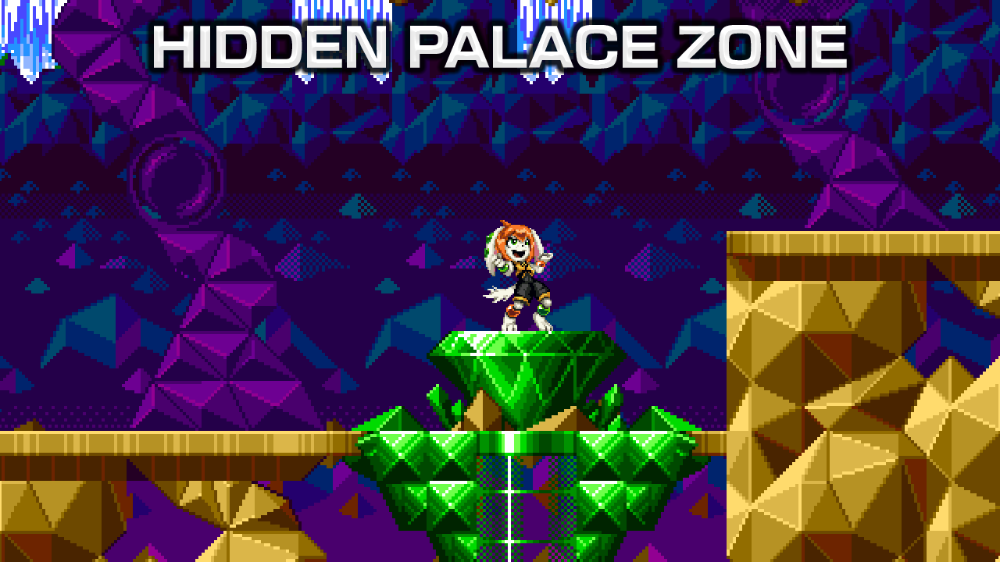
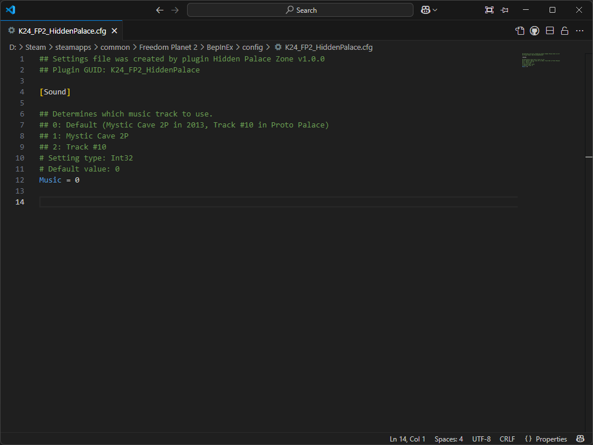

# Freedom Planet 2 Hidden Palace Zone Mod

A mod for Freedom Planet 2 (using [FP2Lib](https://github.com/Kuborros/FP2Lib)) that adds both revisions of Hidden Palace Zone from the mobile/Sonic Origins releases of Sonic The Hedgehog 2 into Freedom Planet 2.

## Building

First off, ensure that your system has [Visual Studio 2022](https://visualstudio.microsoft.com/) installed alongside the `.NET Framework 3.5 development tools`, as well as [Unity 5.6.3](https://unity.com/releases/editor/whats-new/5.6.3#installs), [FP2Lib](https://github.com/Kuborros/FP2Lib) (at least Version 0.4. The [Freedom Manager](https://github.com/Kuborros/FreedomManager) program should install this automatically if used.) and a build of my [Custom Objects plugin](https://github.com/Knuxfan24/Freedom-Planet-2-Custom-Objects).

Open the solution file in VS2022 then go to `Tools > Options` and select `Package Sources` under the `NuGet Package Manager` category. Then add a package source called `BepInEx` with the source url set to `https://nuget.bepinex.dev/v3/index.json`.

Next, go to the `Assemblies` category in the `Dependencies` for the project, then delete the `Assembly-CSharp`, `FP2Lib` and `FP2_Knux_Objects` references. Right click on the Assemblies category and click `Add Assembly Reference...`, then click `Browse...` and navigate to Freedom Planet 2's install directory. Open the `FP2_Data` directory, then the `Managed` directory and select the `Assembly-CSharp.dll` file. Click Add, then Browse again and navigate to the location that FP2Lib's DLL is installed to (likely `BepInEx\Plugins\lib`) and select the `FP2Lib.dll` file. Click Add, then Browse a third time and navigate to the location that your build of `FP2_Knux_Objects.dll` is located. Click Add then click OK.

You should now be able to right click the solution and choose `Rebuild` to build the mod. Though it is recommended to change the build configuration from `Debug` to `Release`, as the debug build prints a lot of console messages that are useless to the average player.

## Installing

Navigate to `BepInEx/plugins` and create a new folder with whatever name you want. Then copy the `FP2_Hidden_Palace_Mod.dll` file from the build (`bin/Debug/net35` or `bin/Release/net35`) into it. If using Freedom Manager, you may also want to copy the included `modinfo.json` file to give the mod a proper entry in the manager, although this is not strictly required.

## Customisation

This mod has a single customisable option (that being the music choice for the two acts). To customise this, go to the `BepInEx/config` and open `K24_FP2_HiddenPalace.cfg` in a text editor. What value corresponds to what is listed within the configuration file itself.